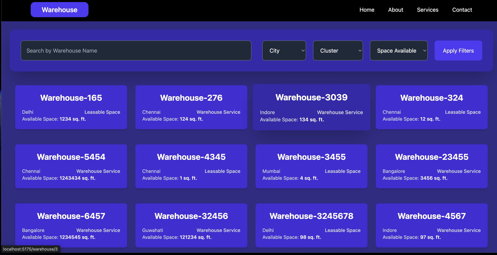
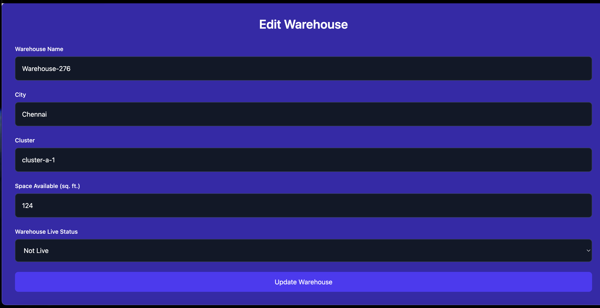

# Warehouse Management Application

## Overview

The Warehouse Management Application is designed to help users manage and track the details of various warehouses. The main features include viewing warehouse details, editing warehouse information, filtering and searching through warehouses, and updating warehouse data. The application uses **React** for the frontend, **Redux** for state management, and **React Router** for routing between different views.

[**Warehouse Management App**](https://warehouses-sddz.vercel.app/)

### Key Features:
- **View Warehouse Details**: View detailed information about each warehouse.
- **Edit Warehouse Information**: Update warehouse details such as name, city, space available, and more.
- **Filter & Search**: Search for warehouses by name and filter by city, cluster, and available space.
- **Responsive Design**: The application is fully responsive, providing an optimized experience across desktop and mobile devices.

## Project Components

1. **Navbar**: A navigation bar that allows users to navigate between different views, including "Home", "About", "Services", and "Contact".
2. **Warehouse Cards**: Displays a summary of warehouse information like name, city, space available, and type in a card format.
3. **Warehouse Filter**: Allows users to search and filter warehouses based on different criteria such as city, cluster, and available space.
4. **Warehouse Details Form**: A form that allows users to edit and update warehouse information.

### Screenshots

1. **Home Page**: The homepage shows a grid of warehouse cards and a filter panel at the top.
   

2. **Warehouse Edit Page**: A form to edit warehouse details, including the ability to change the name, city, cluster, space available, and live status.
   

## Functionalities Implemented

- **Warehouse List & Cards**: Displays warehouse information in a grid format, with clickable cards that lead to detailed warehouse views.
- **Search and Filter Functionality**: Users can search for warehouses by name and apply filters based on the city, cluster, and available space.
- **Edit Warehouse Details**: A form allows users to edit warehouse details, which are saved upon submission.
- **State Management with Redux**: Redux is used to manage global state, including warehouse data, filtered data, and warehouse detail updates.
- **Routing with React Router**: React Router is used to handle navigation between pages, including the home page and the warehouse details page.

## Packages Used

- **React**: The core library for building the user interface.
- **Redux**: Used for managing global state, including warehouse data and updates.
- **React Router**: Handles the routing and navigation between pages.
- **TailwindCSS**: A utility-first CSS framework used for styling components and ensuring responsiveness.
- **React-Redux**: Connects React components to Redux for state management.
- **React Icons**: Provides icons for the navbar and buttons.

